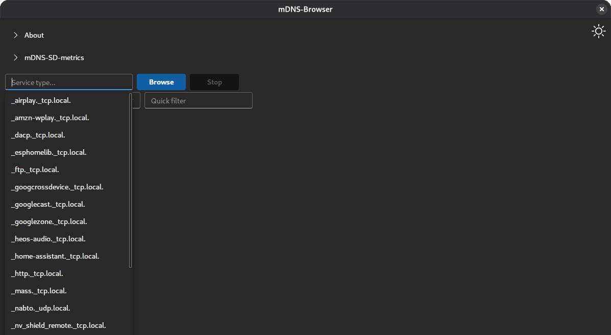
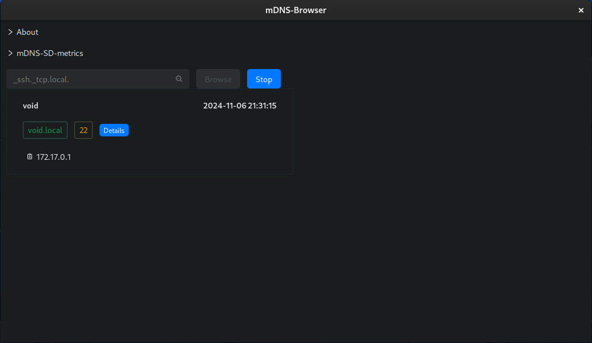
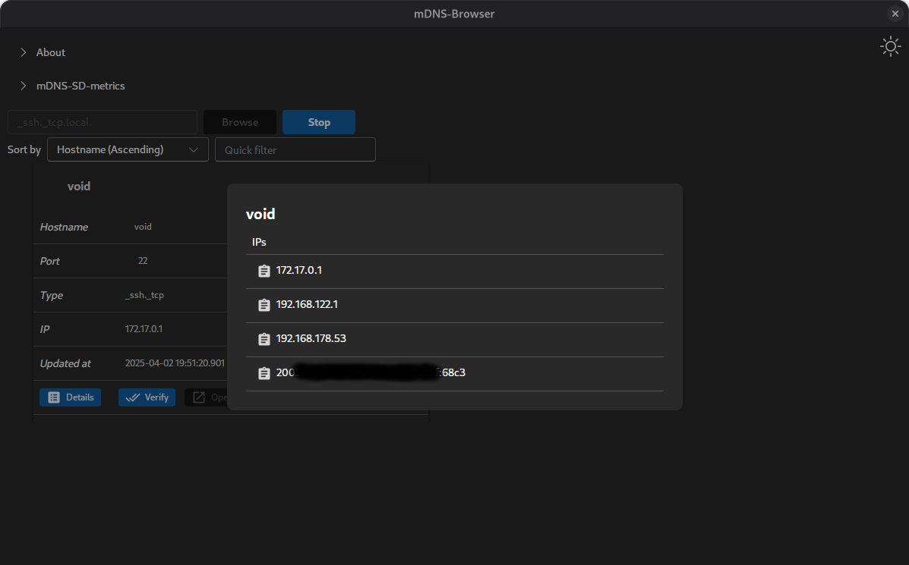
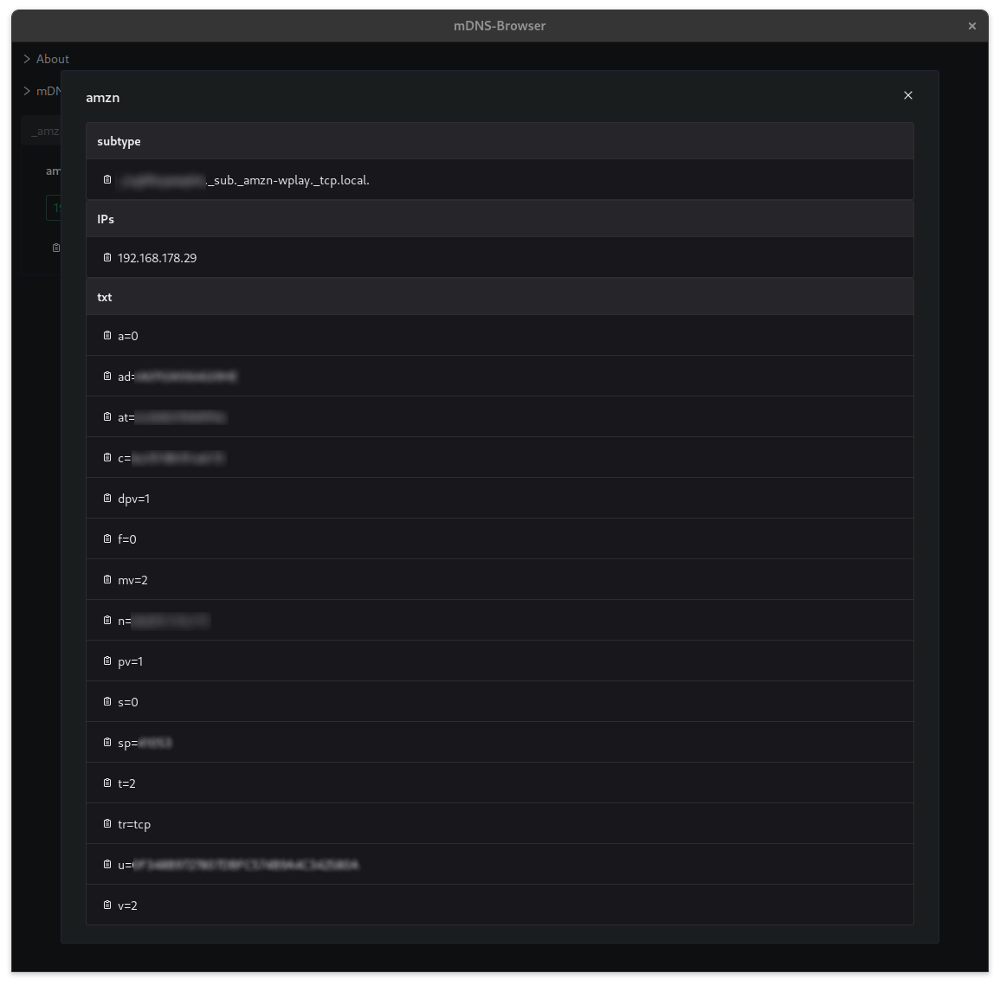
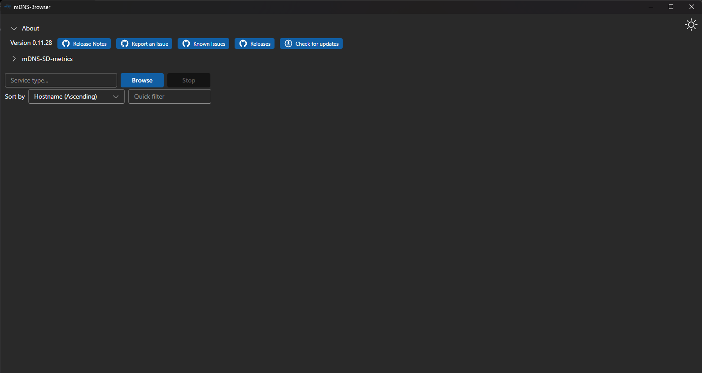
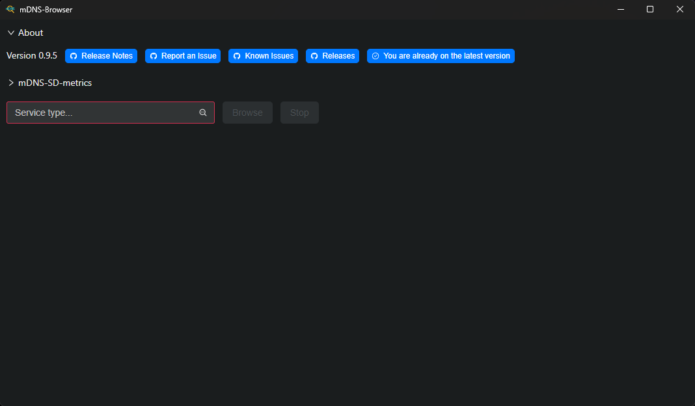

# mDNS-Browser

This application allows you to browse services using mDNS.

Screenshots from [v0.9.5](https://github.com/hrzlgnm/mdns-browser/releases/tag/mdns-browser-v0.9.5)

### Startup



### Browsing for \_ssh.\_tcp



### Details of a resolved service having many IPs



### Details of a resolved service having a subtype and TXT records



### Checking for updates on Windows



### Response if no update is available



<!--toc:start-->

- [mDNS-Browser Overview](#mdns-browser)
  - [How to Build](#building)
  - [Where to find the executables?](#where-to-find-the-executables)
    - [GitHub Release](#github-releases)
    - [Winget Installation](#winget-installation)
    - [Arch Linux (AUR)](#arch-linux-aur)
  - [Privacy](#privacy)
  - [Acknowledgments](#acknowledgments)
  <!--toc:end-->

## Building

For instructions on building the application, checkout the document [BUILDING](BUILDING.md).

## Where to find the executables?

### GitHub Releases

You can download the latest version of the application from the [GitHub Release page](https://github.com/hrzlgnm/mdns-browser/releases/latest)

### Winget installation

To install via Winget, run the following command:

```console
winget install mdns-browser
```

### Arch Linux (AUR)

To install on Arch Linux using the AUR, you can use an AUR helper like yay or paru:

With `yay`:

```console
yay -S mdns-browser
```

Alternatively using the -bin package:

```console
yay -S mdns-browser-bin
```

With `paru`:

```console
paru -S mdns-browser
```

Alternatively using the -bin package:

```console
paru -S mdns-browser-bin
```

## Privacy

For a privacy statement checkout the document [PRIVACY](PRIVACY.md).

## Acknowledgments

This app uses the fantastic [mdns-sd library](https://github.com/keepsimple1/mdns-sd)to handle all mDNS functionality. If you find this app helpful, consider giving the library a star on GitHub!
