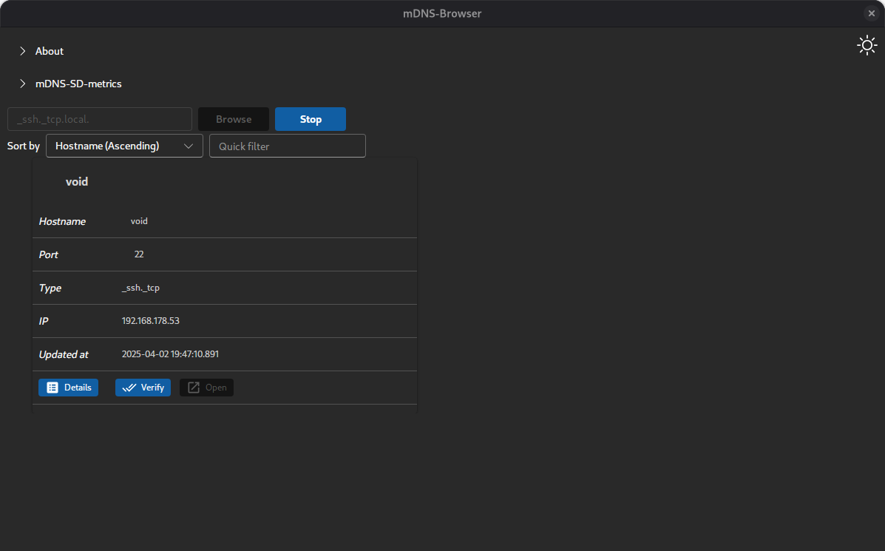
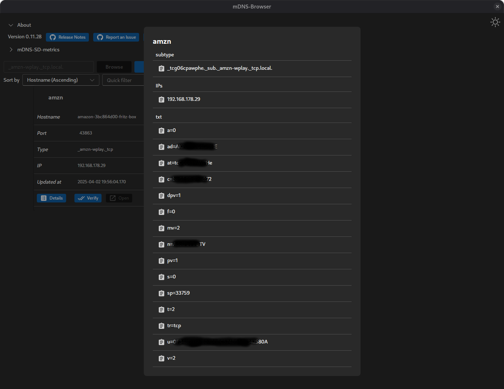
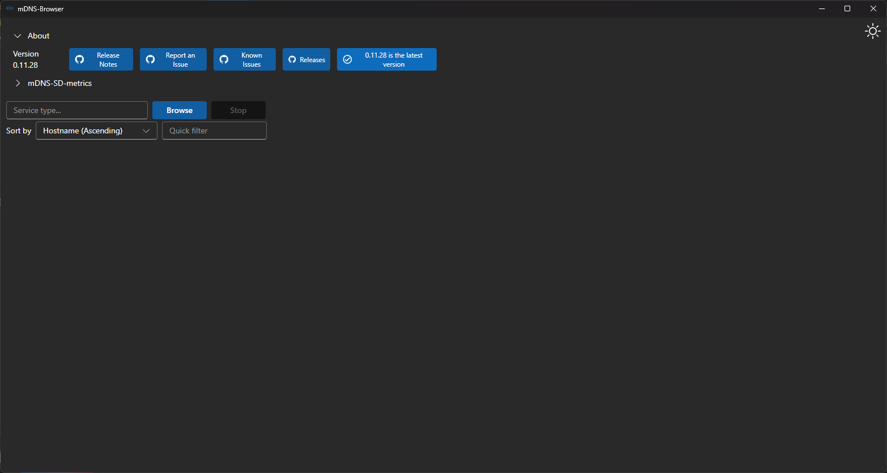

[](https://github.com/hrzlgnm/mdns-browser/blob/main/LICENSE)
[](https://github.com/hrzlgnm/mdns-browser/actions)

# mDNS-Browser

This application allows you to browse services using mDNS.

Screenshots from [v0.11.28](https://github.com/hrzlgnm/mdns-browser/releases/tag/mdns-browser-v0.11.28)

### Startup


### Browsing for \_ssh.\_tcp



### Details of a resolved service having many IPs


### Details of a resolved service having a subtype and TXT records



### Checking for updates on Windows


### Response if no update is available



<!--toc:start-->

- [mDNS-Browser Overview](#mdns-browser)
    - [How to Build](#building)
    - [Command line options](#command-line-options)
    - [Where to find the executables?](#where-to-find-the-executables)
        - [GitHub Release](#github-releases)
        - [Winget Installation](#winget-installation)
        - [Arch Linux (AUR)](#arch-linux-aur)
        - [Void Linux](#void-linux)
    - [Auditable binaries](#auditable-binaries)
    - [Attested build artifacts](#attested-build-artifacts)
    - [Privacy](#privacy)
    - [Acknowledgments](#acknowledgments)

<!--toc:end-->

## Building

For instructions on building the application, checkout the document [BUILDING](BUILDING.md).

## Command line options

```console
Usage: mdns-browser [OPTIONS]

Options:
  -l, --log-level <LOG_LEVEL>    [default: info] [possible values: trace, debug, info, warn, error]
  -D, --enable-devtools          Enable devtools at startup
  -f, --log-to-file              Enable logging to file
  -d, --disable-dmabuf-renderer  Disable dmabuf renderer, useful when having rendering issues
  -h, --help                     Print help
  -V, --version                  Print version

```

### log-to-file

If enabled, a log file will be created in a platform-specific location:

- Windows: `%LOCALAPPDATA%\com.github.hrzlgnm.mdns-browser\logs`
- Linux: `$XDG_DATA_HOME/com.github.hrzlgnm.mdns-browser/logs` or `$HOME/.local/share/com.github.hrzlgnm.mdns-browser/logs`
- macOS: `~/Library/Logs/com.github.hrzlgnm.mdns-browser`

The log file will be named `mdns-browser.log` and will contain log messages with a log-level having at least a level specified by the `log-level` option.

### enable-devtools

If enabled, the devtools will be open at startup

This option has been added with release [v0.19.0](https://github.com/hrzlgnm/mdns-browser/releases/tag/mdns-browser-v0.19.0)

### disable-dmabuf-renderer (Linux only)

This option disables the dmabuf renderer, which is used to improve performance on Linux.
If you experience rendering issues, you can try disabling this option to see if it resolves the problem.

This option has been added with release [v0.12.0](https://github.com/hrzlgnm/mdns-browser/releases/tag/mdns-browser-v0.12.0)

## Where to find the executables?

### GitHub Releases

You can download the latest version of the application from the [GitHub Release page](https://github.com/hrzlgnm/mdns-browser/releases/latest)

### Winget installation

To install via Winget, run the following command:

```console
winget install mdns-browser
```

### Arch Linux (AUR)

To install on Arch Linux using the AUR, you can use an AUR helper like yay or paru:

With `yay`:

```console
yay -S mdns-browser
```

Alternatively using the -bin package:

```console
yay -S mdns-browser-bin
```

With `paru`:

```console
paru -S mdns-browser
```

Alternatively using the -bin package:

```console
paru -S mdns-browser-bin
```

### Void Linux

To install on Void Linux with arch `x86_64`, you can add the GitHub release as a repository and install the package using `xbps-install`:

```console
# Add the repository
echo "repository=https://github.com/hrzlgnm/mdns-browser/releases/latest/download" | sudo tee /etc/xbps.d/mdns-browser-repo.conf

# Install the package
sudo xbps-install -S mdns-browser
```

During installation, you will be prompted to accept a public key signed by `hrzlgnm@users.noreply.github.com`. The repository and package are signed with a key having the fingerprint: `64:6d:b9:23:3d:ad:9d:f1:b0:fe:64:8e:da:46:57:d3`.

## Auditable binaries

The binaries built for desktop targets are now all built in auditable mode using [cargo-auditable](https://github.com/rust-secure-code/cargo-auditable?tab=readme-ov-file#cargo-auditable).
For information on how to audit the binaries, see [Usage](https://github.com/rust-secure-code/cargo-auditable?tab=readme-ov-file#usage)

Since release v0.8.x

## Attested build artifacts

The build artifacts are now attested. Attestations information about the binaries is available [here](https://github.com/hrzlgnm/mdns-browser/attestations). For more information and details on how to verify those, see [Verifying artifact attestations with the GitHub CLI](https://docs.github.com/en/actions/security-for-github-actions/using-artifact-attestations/using-artifact-attestations-to-establish-provenance-for-builds#verifying-artifact-attestations-with-the-github-cli)

Since release v0.8.x

## Privacy

For a privacy statement checkout the document [PRIVACY](PRIVACY.md).

## Acknowledgments

This app uses the fantastic [mdns-sd library](https://github.com/keepsimple1/mdns-sd)to handle all mDNS functionality. If you find this app helpful, consider giving the library a star on GitHub!
